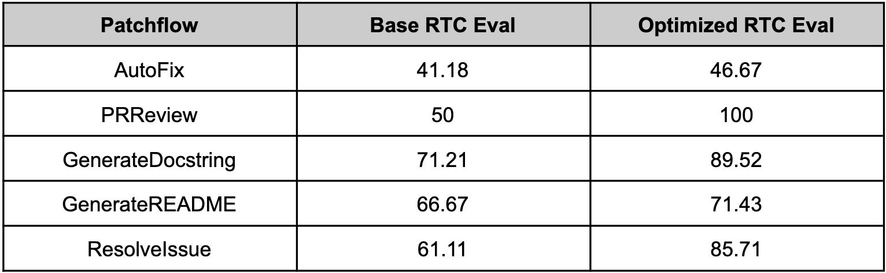

# optillm

optillm is an OpenAI API compatible optimizing inference proxy which implements several state-of-the-art techniques that can improve the accuracy and performance of LLMs. The current focus is on implementing techniques that improve reasoning over coding, logical and mathematical queries. It is possible to beat the frontier models using these techniques across diverse tasks by doing additional compute at inference time.

## Patchwork with optillm

Since optillm is a drop-in replacement for OpenAI API you can easily integrate it with existing tools and frameworks using the OpenAI client. We used optillm with [patchwork](https://github.com/patched-codes/patchwork) which is an open-source framework that automates development gruntwork like PR reviews, bug fixing, security patching using workflows
called patchflows. We saw huge performance gains across all the supported patchflows as shown below. 



## SOTA results on benchmarks with optillm

### plansearch-gpt-4o-mini on LiveCodeBench (Sep 2024)

| Model                  | pass@1 | pass@5 | pass@10 |
| ---------------------- | ------ | ------ | ------- |
| plansearch-gpt-4o-mini | 44.03  | 59.31  | 63.5    |
| gpt-4o-mini            | 43.9   | 50.61  | 53.25   |
| claude-3.5-sonnet      | 51.3   |        |         |
| gpt-4o-2024-05-13      | 45.2   |        |         |
| gpt-4-turbo-2024-04-09 | 44.2   |        |         |

### moa-gpt-4o-mini on Arena-Hard-Auto (Aug 2024)


## Installation

Just clone the repository with `git` and use `pip install` to setup the dependencies.

```bash
git clone https://github.com/codelion/optillm.git
cd optillm
python3 -m venv .venv
source .venv/bin/activate
pip install -r requirements.txt
```

You can then run the optillm proxy as follows.

```bash
python optillm.py
2024-09-06 07:57:14,191 - INFO - Starting server with approach: auto
2024-09-06 07:57:14,191 - INFO - Server configuration: {'approach': 'auto', 'mcts_simulations': 2, 'mcts_exploration': 0.2, 'mcts_depth': 1, 'best_of_n': 3, 'model': 'gpt-4o-mini', 'rstar_max_depth': 3, 'rstar_num_rollouts': 5, 'rstar_c': 1.4, 'base_url': ''}
 * Serving Flask app 'optillm'
 * Debug mode: off
2024-09-06 07:57:14,212 - INFO - WARNING: This is a development server. Do not use it in a production deployment. Use a production WSGI server instead.
 * Running on all addresses (0.0.0.0)
 * Running on http://127.0.0.1:8000
 * Running on http://192.168.10.48:8000
2024-09-06 07:57:14,212 - INFO - Press CTRL+C to quit
```

## Usage

Once the proxy is running, you can use it as a drop in replacement for an OpenAI client by setting the `base_url` as `http://localhost:8000/v1`.

```python
import os
from openai import OpenAI

OPENAI_KEY = os.environ.get("OPENAI_API_KEY")
OPENAI_BASE_URL = "http://localhost:8000/v1"
client = OpenAI(api_key=OPENAI_KEY, base_url=OPENAI_BASE_URL)

response = client.chat.completions.create(
  model="moa-gpt-4o",
  messages=[
    {
      "role": "user",
      "content": "Write a Python program to build an RL model to recite text from any position that the user provides, using only numpy."
    }
  ],
  temperature=0.2
)

print(response)
```

You can control the technique you use for optimization by prepending the slug to the model name `{slug}-model-name`. E.g. in the above code we are using `moa` or
mixture of agents as the optimization approach. In the proxy logs you will see the following showing the `moa` is been used with the base model as `gpt-4o-mini`.

```bash
2024-09-06 08:35:32,597 - INFO - Using approach moa, with gpt-4o-mini
2024-09-06 08:35:35,358 - INFO - HTTP Request: POST https://api.openai.com/v1/chat/completions "HTTP/1.1 200 OK"
2024-09-06 08:35:39,553 - INFO - HTTP Request: POST https://api.openai.com/v1/chat/completions "HTTP/1.1 200 OK"
2024-09-06 08:35:44,795 - INFO - HTTP Request: POST https://api.openai.com/v1/chat/completions "HTTP/1.1 200 OK"
2024-09-06 08:35:44,797 - INFO - 127.0.0.1 - - [06/Sep/2024 08:35:44] "POST /v1/chat/completions HTTP/1.1" 200 -
```

## Implemented techniques

| Technique               | Slug               | Description                                                                                    |
| ----------------------- | ------------------ | ---------------------------------------------------------------------------------------------- |
| Agent                   | `agent`            | Determines which of the below approaches to take and then combines the results                 |
| Monte Carlo Tree Search | `mcts`             | Uses MCTS for decision-making in chat responses                                                |
| Best of N Sampling      | `bon`              | Generates multiple responses and selects the best one                                          |
| Mixture of Agents       | `moa`              | Combines responses from multiple critiques                                                     |
| Round Trip Optimization | `rto`              | Optimizes responses through a round-trip process                                               |
| Z3 Solver               | `z3`               | Utilizes the Z3 theorem prover for logical reasoning                                           |
| Self-Consistency        | `self_consistency` | Implements an advanced self-consistency method                                                 |
| PV Game                 | `pvg`              | Applies a prover-verifier game approach at inference time                                      |
| R* Algorithm            | `rstar`            | Implements the R* algorithm for problem-solving                                                |
| CoT with Reflection     | `cot_reflection`   | Implements chain-of-thought reasoning with \<thinking\>, \<reflection> and \<output\> sections |
| PlanSearch              | `plansearch`       | Implements a search algorithm over candidate plans for solving a problem in natural language   |
| LEAP                    | `leap`             | Learns task-specific principles from few shot examples                                         |

## Available Parameters

optillm supports various command-line arguments and environment variables for configuration.

| Parameter                | Description                                                     | Default Value   |
|--------------------------|-----------------------------------------------------------------|-----------------|
| `--approach`             | Inference approach to use                                       | `"auto"`        |
| `--simulations`          | Number of MCTS simulations                                      | 2               |
| `--exploration`          | Exploration weight for MCTS                                     | 0.2             |
| `--depth`                | Simulation depth for MCTS                                       | 1               |
| `--best-of-n`            | Number of samples for best_of_n approach                        | 3               |
| `--model`                | OpenAI model to use                                             | `"gpt-4o-mini"` |
| `--base-url`             | Base URL for OpenAI compatible endpoint                         | `""`            |
| `--rstar-max-depth`      | Maximum depth for rStar algorithm                               | 3               |
| `--rstar-num-rollouts`   | Number of rollouts for rStar algorithm                          | 5               |
| `--rstar-c`              | Exploration constant for rStar algorithm                        | 1.4             |
| `--n`                    | Number of final responses to be returned                        | 1               |
| `--return-full-response` | Return the full response including the CoT with <thinking> tags | `False`         |
| `--port`                 | Specify the port to run the proxy                               | 8000            |
| `--api-key`              | Optional API key for client authentication to optillm           | `""`            |

When using Docker, these can be set as environment variables prefixed with `OPTILLM_`.

## Running with Docker

optillm can optionally be built and run using Docker and the provided [Dockerfile](./Dockerfile).

### Using Docker Compose

1. Make sure you have Docker and Docker Compose installed on your system.

2. Either update the environment variables in the docker-compose.yaml file or create a `.env` file in the project root directory and add any environment variables you want to set. For example, to set the OpenAI API key, add the following line to the `.env` file:

   ```bash
   OPENAI_API_KEY=your_openai_api_key_here
   ```

3. Run the following command to start optillm:

   ```bash
   docker compose up -d
   ```

   This will build the Docker image if it doesn't exist and start the optillm service.

4. optillm will be available at `http://localhost:8000`.

When using Docker, you can set these parameters as environment variables. For example, to set the approach and model, you would use:

```bash
OPTILLM_APPROACH=mcts
OPTILLM_MODEL=gpt-4
```

To secure the optillm proxy with an API key, set the `OPTILLM_API_KEY` environment variable:

```bash
OPTILLM_API_KEY=your_secret_api_key
```

When the API key is set, clients must include it in their requests using the `Authorization` header:

```plain
Authorization: Bearer your_secret_api_key
```

## References

- [In-Context Principle Learning from Mistakes](https://arxiv.org/abs/2402.05403)
- [Planning In Natural Language Improves LLM Search For Code Generation](https://arxiv.org/abs/2409.03733)
- [Self-Consistency Improves Chain of Thought Reasoning in Language Models](https://arxiv.org/abs/2203.11171)
- [Mutual Reasoning Makes Smaller LLMs Stronger Problem-Solvers](https://arxiv.org/abs/2408.06195)
- [Mixture-of-Agents Enhances Large Language Model Capabilities](https://arxiv.org/abs/2406.04692)
- [Prover-Verifier Games improve legibility of LLM outputs](https://arxiv.org/abs/2407.13692)
- [Monte Carlo Tree Search Boosts Reasoning via Iterative Preference Learning](https://arxiv.org/abs/2405.00451)
- [Unsupervised Evaluation of Code LLMs with Round-Trip Correctness](https://arxiv.org/abs/2402.08699)
- [Patched MOA: optimizing inference for diverse software development tasks](https://arxiv.org/abs/2407.18521)
- [Patched RTC: evaluating LLMs for diverse software development tasks](https://arxiv.org/abs/2407.16557)
