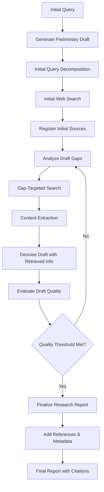

# Deep Research Plugin

## Overview

The Deep Research plugin implements the **Test-Time Diffusion Deep Researcher (TTD-DR)** algorithm, a state-of-the-art approach for comprehensive research report generation. This implementation is based on the paper ["Deep Researcher with Test-Time Diffusion"](https://arxiv.org/abs/2507.16075v1) and provides iterative, in-depth research capabilities for complex queries.

## Algorithm Overview

The TTD-DR algorithm treats research as a **diffusion process** with iterative refinement through denoising and retrieval. Unlike traditional search approaches that return raw results, this implementation performs:

1. **Preliminary Draft Generation** - Creates an initial "updatable skeleton" from LLM internal knowledge
2. **Initial Query Decomposition** - Breaks complex queries into focused sub-questions
3. **Gap Analysis** - Identifies areas in the draft needing external research
4. **Iterative Denoising** - Performs multiple rounds of gap-targeted search and draft refinement
5. **Quality-Guided Termination** - Automatically assesses draft quality to determine when research is complete
6. **Report Finalization** - Produces structured, academic-quality reports with proper citations

**Note:** This is a simplified implementation of the TTD-DR paper. Some advanced features like component-wise self-evolutionary optimization and memory-based synthesis are not yet implemented.

## Architecture

```
deep_research/
├── __init__.py              # Package initialization
├── research_engine.py       # Core TTD-DR implementation
└── README.md               # This documentation

../deep_research_plugin.py  # OptiLLM plugin interface
```

### Key Components

#### 1. `DeepResearcher` Class (`research_engine.py`)

The core implementation of the TTD-DR algorithm with the following key methods:

- **`decompose_query()`** - Implements query planning phase
- **`perform_web_search()`** - Orchestrates web search using individual queries to avoid truncation
- **`extract_and_fetch_urls()`** - Extracts sources and fetches content
- **`analyze_draft_gaps()`** - Analyzes current draft to identify gaps and areas needing research
- **`perform_gap_targeted_search()`** - Performs targeted searches based on identified gaps
- **`denoise_draft_with_retrieval()`** - Core denoising step integrating retrieved information with current draft
- **`evaluate_draft_quality()`** - Evaluates quality improvement of current draft vs previous iteration
- **`finalize_research_report()`** - Applies final polishing to the research report
- **`research()`** - Main research loop implementing TTD-DR diffusion process

#### 2. Plugin Interface (`deep_research_plugin.py`)

Minimal interface that integrates with OptiLLM's plugin system:

```python
def run(system_prompt: str, initial_query: str, client, model: str, request_config: Optional[Dict] = None) -> Tuple[str, int]
```

## Implementation Details

### Research Process Flow



### Citation System

The plugin implements a sophisticated citation tracking system:

- **Inline Citations**: `[1]`, `[2]`, `[3]` format throughout the text
- **Source Tracking**: Maps citation numbers to source metadata
- **Deduplication**: Avoids duplicate citations for the same URL
- **Academic Format**: Proper reference formatting with URLs and access dates

### Report Structure

Generated reports follow academic standards:

1. **Executive Summary** - Key findings overview
2. **Introduction** - Research question and significance
3. **Background** - Context and foundational information
4. **Key Findings** - Main discoveries with citations
5. **Analysis and Discussion** - Interpretation and implications
6. **Conclusion** - Summary and final thoughts
7. **Recommendations** - Actionable suggestions (when applicable)
8. **Limitations and Future Research** - Research constraints and future directions
9. **References** - Complete source list with metadata

## Configuration

The plugin accepts the following configuration parameters:

```python
request_config = {
    "max_iterations": 5,    # Maximum research iterations (default: 5)
    "max_sources": 10       # Maximum sources per search (default: 10)
}
```

## Dependencies

The Deep Research plugin requires these OptiLLM plugins:

- **`web_search`** - Chrome-based Google search automation
- **`readurls`** - Content extraction from URLs

## Usage Examples

### Basic Usage

```python
from optillm.plugins.deep_research_plugin import run

result, tokens = run(
    system_prompt="You are a research assistant",
    initial_query="What are the latest advances in quantum error correction?",
    client=openai_client,
    model="gpt-4o-mini"
)
```

### Advanced Configuration

```python
result, tokens = run(
    system_prompt="You are a research assistant",
    initial_query="Analyze the impact of AI on healthcare diagnostics",
    client=openai_client,
    model="gpt-4o-mini",
    request_config={
        "max_iterations": 3,
        "max_sources": 8
    }
)
```

### With OptiLLM Server

```python
from openai import OpenAI

client = OpenAI(base_url="http://localhost:8000/v1", api_key="optillm")

response = client.chat.completions.create(
    model="deep_research-gpt-4o-mini",
    messages=[
        {"role": "user", "content": "Research the latest developments in renewable energy storage"}
    ],
    extra_body={
        "request_config": {
            "max_iterations": 3,
            "max_sources": 10
        }
    }
)
```

## Performance Characteristics

- **Time Complexity**: O(iterations × sources × content_size)
- **Typical Duration**: 2-5 minutes per research query
- **Token Usage**: 1,000-5,000 tokens per iteration
- **Memory Requirements**: Scales with content volume and context size

## Reasoning Model Compatibility

The plugin is fully compatible with reasoning models that include internal thinking processes:

- **Automatic Cleanup**: Removes `<think>`, `<thinking>`, `<reasoning>`, `<reflection>` tags from all responses
- **Professional Output**: Ensures final reports contain only clean, formatted content
- **Seamless Integration**: Works transparently with any model type
- **Supported Tags**: `<think>`, `<thinking>`, `<reasoning>`, `<thought>`, `<reflect>`, `<reflection>`

Example cleanup:
```
Input:  "<think>Let me analyze this</think>\n\n# Research Report\nContent here..."
Output: "# Research Report\nContent here..."
```

## Error Handling

The plugin includes comprehensive error handling:

1. **Graceful Degradation** - Falls back to basic LLM response on critical failures
2. **Timeout Management** - Handles web search and content fetching timeouts
3. **Rate Limiting** - Includes delays to avoid search engine restrictions
4. **Validation** - Input validation and configuration checks

## Quality Assurance

The implementation follows the TTD-DR paper's quality criteria:

- **Comprehensive Coverage** - Addresses all aspects of the research query
- **Source Diversity** - Incorporates multiple credible sources
- **Citation Accuracy** - Proper attribution for all claims and findings
- **Academic Rigor** - Maintains objectivity and scholarly tone
- **Iterative Refinement** - Continuously improves research quality
- **Clean Output** - Automatically removes reasoning tags (`<think>`, `<thinking>`, etc.) for professional reports

## Comparison to Simple Search

| Feature | Simple Search | Deep Research (TTD-DR) |
|---------|---------------|------------------------|
| Query Processing | Single query | Multi-query decomposition |
| Iteration | Single pass | Multiple denoising cycles |
| Draft Evolution | None | Preliminary draft with iterative refinement |
| Gap Detection | None | Automatic draft gap analysis |
| Search Strategy | Broad search | Gap-targeted focused search |
| Citations | Manual | Automatic with tracking |
| Report Format | Unstructured | Academic report structure |
| Quality Evaluation | None | Quality-guided termination |

## Future Enhancements

Potential improvements aligned with the TTD-DR paper and research directions:

1. **Component-wise Self-Evolutionary Optimization** - Implement fitness-based evolution of search, synthesis, and integration components as described in the paper
2. **Memory-based Synthesis** - Integrate memory plugin for unbounded context processing
3. **Parallel Processing** - Concurrent search execution
4. **Domain Specialization** - Field-specific research strategies
5. **Multimedia Integration** - Image and video content analysis
6. **Real-time Updates** - Live research monitoring and updates
7. **Collaborative Research** - Multi-agent research coordination

## Troubleshooting

### Common Issues

1. **Chrome Browser Issues**
   - Ensure Chrome is installed and accessible
   - Check for CAPTCHA requirements (plugin supports manual solving)

2. **Rate Limiting**
   - Plugin includes automatic delays
   - Consider increasing delay settings for aggressive rate limiting

3. **Memory Constraints**
   - Large research queries may consume significant memory
   - Monitor token usage and consider iteration limits

4. **Citation Extraction**
   - URL parsing depends on search result format
   - Plugin includes fallback parsing methods

5. **Search Query Processing**
   - Plugin uses individual searches for each sub-query to prevent truncation
   - If search results seem incomplete, check that decomposed queries are reasonable
   - Each sub-query is processed separately to ensure complete coverage

### Debug Mode

Enable debug output by checking the console logs during research execution. The plugin provides detailed logging of each research phase.

## Contributing

When contributing to the Deep Research plugin:

1. Maintain compatibility with the TTD-DR algorithm
2. Preserve citation tracking functionality
3. Ensure academic report structure compliance
4. Test with various query types and complexity levels
5. Document any new configuration options

