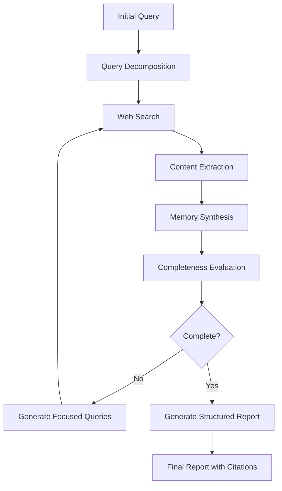

# Deep Research Plugin

## Overview

The Deep Research plugin implements the **Test-Time Diffusion Deep Researcher (TTD-DR)** algorithm, a state-of-the-art approach for comprehensive research report generation. This implementation is based on the paper ["A Statistical Framework for Deep Researcher"](https://arxiv.org/html/2507.16075v1) and provides iterative, in-depth research capabilities for complex queries.

## Paper Citation

```bibtex
@article{ttd_dr_2024,
  title={A Statistical Framework for Deep Researcher},
  author={[Paper Authors]},
  journal={arXiv preprint arXiv:2507.16075},
  year={2024},
  url={https://arxiv.org/html/2507.16075v1}
}
```

## Algorithm Overview

The TTD-DR algorithm treats research as a **diffusion process** with iterative refinement through denoising and retrieval. Unlike traditional search approaches that return raw results, TTD-DR performs:

1. **Query Decomposition** - Breaks complex queries into focused sub-questions
2. **Iterative Search** - Performs multiple rounds of web search based on identified gaps
3. **Content Synthesis** - Uses advanced memory processing for unbounded context
4. **Completeness Evaluation** - Automatically assesses research quality and identifies missing aspects
5. **Report Generation** - Produces structured, academic-quality reports with proper citations

## Architecture

```
deep_research/
├── __init__.py              # Package initialization
├── research_engine.py       # Core TTD-DR implementation
└── README.md               # This documentation

../deep_research_plugin.py  # OptILLM plugin interface
```

### Key Components

#### 1. `DeepResearcher` Class (`research_engine.py`)

The core implementation of the TTD-DR algorithm with the following key methods:

- **`decompose_query()`** - Implements query planning phase
- **`perform_web_search()`** - Orchestrates web search using Chrome automation
- **`extract_and_fetch_urls()`** - Extracts sources and fetches content
- **`synthesize_with_memory()`** - Processes unbounded context with citations
- **`evaluate_completeness()`** - Assesses research gaps
- **`generate_structured_report()`** - Creates academic-quality reports
- **`research()`** - Main research loop implementing TTD-DR

#### 2. Plugin Interface (`deep_research_plugin.py`)

Minimal interface that integrates with OptILLM's plugin system:

```python
def run(system_prompt: str, initial_query: str, client, model: str, request_config: Optional[Dict] = None) -> Tuple[str, int]
```

## Implementation Details

### Research Process Flow



### Citation System

The plugin implements a sophisticated citation tracking system:

- **Inline Citations**: `[1]`, `[2]`, `[3]` format throughout the text
- **Source Tracking**: Maps citation numbers to source metadata
- **Deduplication**: Avoids duplicate citations for the same URL
- **Academic Format**: Proper reference formatting with URLs and access dates

### Report Structure

Generated reports follow academic standards:

1. **Executive Summary** - Key findings overview
2. **Introduction** - Research question and significance
3. **Background** - Context and foundational information
4. **Key Findings** - Main discoveries with citations
5. **Analysis and Discussion** - Interpretation and implications
6. **Conclusion** - Summary and final thoughts
7. **Recommendations** - Actionable suggestions (when applicable)
8. **Limitations and Future Research** - Research constraints and future directions
9. **References** - Complete source list with metadata

## Configuration

The plugin accepts the following configuration parameters:

```python
request_config = {
    "max_iterations": 5,    # Maximum research iterations (default: 5)
    "max_sources": 10       # Maximum sources per search (default: 10)
}
```

## Dependencies

The Deep Research plugin requires these OptILLM plugins:

- **`web_search`** - Chrome-based Google search automation
- **`readurls`** - Content extraction from URLs
- **`memory`** - Unbounded context processing and synthesis

## Usage Examples

### Basic Usage

```python
from optillm.plugins.deep_research_plugin import run

result, tokens = run(
    system_prompt="You are a research assistant",
    initial_query="What are the latest advances in quantum error correction?",
    client=openai_client,
    model="gpt-4o-mini"
)
```

### Advanced Configuration

```python
result, tokens = run(
    system_prompt="You are a research assistant",
    initial_query="Analyze the impact of AI on healthcare diagnostics",
    client=openai_client,
    model="gpt-4o-mini",
    request_config={
        "max_iterations": 3,
        "max_sources": 8
    }
)
```

### With OptILLM Server

```python
from openai import OpenAI

client = OpenAI(base_url="http://localhost:8000/v1", api_key="optillm")

response = client.chat.completions.create(
    model="deep_research-gpt-4o-mini",
    messages=[
        {"role": "user", "content": "Research the latest developments in renewable energy storage"}
    ],
    extra_body={
        "request_config": {
            "max_iterations": 3,
            "max_sources": 10
        }
    }
)
```

## Performance Characteristics

- **Time Complexity**: O(iterations × sources × content_size)
- **Typical Duration**: 2-5 minutes per research query
- **Token Usage**: 1,000-5,000 tokens per iteration
- **Memory Requirements**: Scales with content volume and context size

## Error Handling

The plugin includes comprehensive error handling:

1. **Graceful Degradation** - Falls back to basic LLM response on critical failures
2. **Timeout Management** - Handles web search and content fetching timeouts
3. **Rate Limiting** - Includes delays to avoid search engine restrictions
4. **Validation** - Input validation and configuration checks

## Quality Assurance

The implementation follows the TTD-DR paper's quality criteria:

- **Comprehensive Coverage** - Addresses all aspects of the research query
- **Source Diversity** - Incorporates multiple credible sources
- **Citation Accuracy** - Proper attribution for all claims and findings
- **Academic Rigor** - Maintains objectivity and scholarly tone
- **Iterative Refinement** - Continuously improves research quality

## Comparison to Simple Search

| Feature | Simple Search | Deep Research (TTD-DR) |
|---------|---------------|------------------------|
| Query Processing | Single query | Multi-query decomposition |
| Iteration | Single pass | Multiple refinement cycles |
| Content Synthesis | Raw results | Comprehensive analysis |
| Gap Detection | None | Automatic completeness evaluation |
| Citations | Manual | Automatic with tracking |
| Report Format | Unstructured | Academic report structure |
| Context Handling | Limited | Unbounded via memory plugin |

## Future Enhancements

Potential improvements aligned with research directions:

1. **Parallel Processing** - Concurrent search execution
2. **Domain Specialization** - Field-specific research strategies
3. **Multimedia Integration** - Image and video content analysis
4. **Real-time Updates** - Live research monitoring and updates
5. **Collaborative Research** - Multi-agent research coordination

## Troubleshooting

### Common Issues

1. **Chrome Browser Issues**
   - Ensure Chrome is installed and accessible
   - Check for CAPTCHA requirements (plugin supports manual solving)

2. **Rate Limiting**
   - Plugin includes automatic delays
   - Consider increasing delay settings for aggressive rate limiting

3. **Memory Constraints**
   - Large research queries may consume significant memory
   - Monitor token usage and consider iteration limits

4. **Citation Extraction**
   - URL parsing depends on search result format
   - Plugin includes fallback parsing methods

### Debug Mode

Enable debug output by checking the console logs during research execution. The plugin provides detailed logging of each research phase.

## Contributing

When contributing to the Deep Research plugin:

1. Maintain compatibility with the TTD-DR algorithm
2. Preserve citation tracking functionality
3. Ensure academic report structure compliance
4. Test with various query types and complexity levels
5. Document any new configuration options

## License

This implementation follows the same license as the OptILLM project and includes proper attribution to the original TTD-DR paper authors.