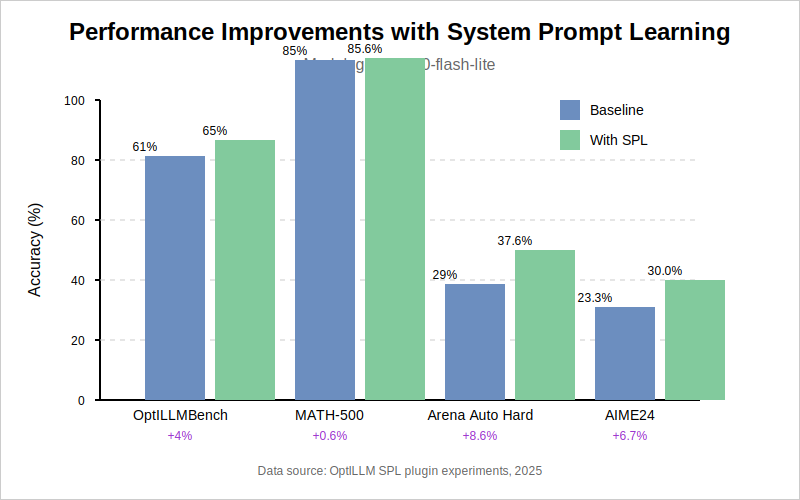
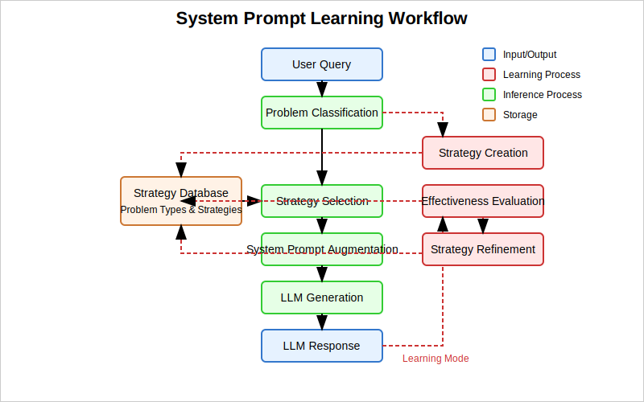

# System Prompt Learning (SPL) Plugin for OptiLLM

This plugin implements Andrej Karpathy's [proposed](https://x.com/karpathy/status/1921368644069765486) "third paradigm" for LLM learning, enabling large language models to learn and improve their problem-solving strategies over time through experience and reflection.

## Introduction: The Evolution of LLM Learning

Large Language Models (LLMs) have traditionally learned in two primary ways:
1. **Pretraining**: Learning facts, patterns, and language from massive text corpora
2. **Finetuning**: Learning behaviors through supervised or reinforcement learning

System Prompt Learning introduces a third paradigm:
3. **Strategy Learning**: The model learns explicit problem-solving strategies through experience, maintains them in a growing knowledge base, and applies them selectively based on problem types

This approach addresses a fundamental limitation of current LLMs—their inability to learn cumulatively from experience. While LLMs can solve individual problems impressively, they typically approach each new problem from scratch rather than building on past successes.

## The SPL Paradigm

System Prompt Learning represents a significant shift in how LLMs approach problem-solving:

- **Experience-Driven Learning**: Rather than relying solely on pretraining or supervised finetuning, SPL enables models to learn from their own problem-solving experiences
- **Strategy Formalization**: The system explicitly generates, evaluates, and refines problem-solving strategies
- **Performance Tracking**: SPL tracks which strategies work well for different problem types, creating a dynamic feedback loop
- **Selective Application**: When faced with a new problem, the system selects the most relevant strategies based on similarity and past performance

This approach mirrors how human experts develop expertise—by accumulating strategies through experience and applying them selectively to new situations.

## Experimental Results

We conducted extensive experiments using the SPL plugin with gemini-2.0-flash-lite on various benchmarks. The learning phase used the OptILLMBench training split (400 instances), while evaluation was performed on the test split (100 instances) and additional popular mathematical benchmarks.

The results demonstrate consistent improvements across all benchmarks:

| Benchmark | Baseline | With SPL | Improvement |
|-----------|----------|----------|-------------|
| OptILLMBench | 61% | 65% | +4% |
| MATH-500 | 85% | 85.6% | +0.6% |
| Arena Auto Hard | 29% | 37.6% | +8.6% |
| AIME24 | 23.33% | 30% | +6.67% |

These results are particularly notable for the challenging Arena Auto Hard and AIME24 benchmarks, where traditional approaches often struggle. The improvements suggest that SPL is especially effective for complex problem-solving tasks that benefit from strategic approaches.



*Figure 1: Performance comparison between baseline gemini-2.0-flash-lite and the same model with SPL across multiple mathematical benchmarks.*

## Usage

### Basic Usage

Use the plugin by prefixing your model name with `spl-`:

```
spl-gpt-4o
```

### Combining with Other Plugins

SPL can be combined with other plugins using the `&` operator:

```
spl&memory-gpt-4o
```

### Learning Mode

By default, the plugin runs in inference-only mode, which uses existing strategies without creating or modifying them. To enable learning mode, which allows the plugin to create and refine strategies based on usage, add the `spl_learning` parameter to the request config:

```python
client.chat.completions.create(
    model="spl-gpt-4o",
    messages=[
        {"role": "system", "content": system_prompt},
        {"role": "user", "content": query}
    ],
    extra_body= {"spl_learning": True},
)
```

## How It Works

1. **Problem Classification**: The plugin analyzes each query to determine its problem type
2. **Strategy Selection**: It selects relevant strategies from its database based on the problem type and content
3. **System Prompt Augmentation**: Selected strategies (up to MAX_STRATEGIES_FOR_INFERENCE) are added to the system prompt

When learning mode is enabled, the plugin also performs:

4. **Effectiveness Evaluation**: After generating a response, the system evaluates how well each strategy worked
5. **Strategy Creation & Refinement**: The system creates new strategies for unseen problem types and periodically refines existing strategies based on usage

The plugin maintains two separate limits:
- **Storage Limit** (MAX_STRATEGIES_PER_TYPE): Controls how many strategies can be stored in the database per problem type
- **Inference Limit** (MAX_STRATEGIES_FOR_INFERENCE): Controls how many strategies are used during inference for system prompt augmentation



*Figure 2: The SPL learning and inference workflow showing how strategies are learned, refined, and applied.*

## Learning Metrics

After training on the OptILLMBench dataset, the system developed a rich knowledge base of strategies:

- **Total queries processed**: 500
- **Strategies created**: 129
- **Strategies refined**: 97
- **Successful resolutions**: 346
- **Strategies merged**: 28

These metrics indicate a healthy learning process with a balance between creation, refinement, and merging of similar strategies.

## Data Storage

Strategies are stored in JSON format in the `spl_data` directory:
- `strategies.json`: Contains all learned strategies
- `metrics.json`: Contains performance metrics and usage statistics

## Configuration

The SPL plugin maintains these core files:
- **Strategy Database**: `/optillm/plugins/spl/data/strategies.json`
- **Metrics**: `/optillm/plugins/spl/data/metrics.json`

You can:
1. Backup these files to preserve learned strategies
2. Edit the strategies.json file to manually add or modify strategies
3. Reset the learning by deleting these files (they will be recreated)

## Example Strategy

Below is an example of a strategy learned by the system for word problems:

```json
{
  "strategy_id": "strategy_3",
  "problem_type": "word_problem",
  "strategy_text": "**Refined Strategy for Solving Word Problems:**\n\n1.  **Understand:**\n    *   Read the problem carefully (multiple times).\n    *   Identify the question (what are you trying to find?).\n    *   List all given information (facts, numbers, units).\n    *   Clarify ambiguous terms/units.\n\n2.  **Organize Information & Identify Unknowns:**\n    *   Choose an organization method: (e.g., table, diagram, list, drawing).\n    *   Clearly identify the unknowns (what you need to solve for).\n\n3.  **Plan and Translate:**\n    *   Define *all* variables with units (e.g.,  `p = number of pennies`, `c = number of compartments`).\n    *   Identify relationships between knowns and unknowns.\n    *   Convert units if necessary.\n    *   Write equations or expressions, including units, that relate the knowns and unknowns.\n    *   Ensure units are consistent throughout the equations.\n    *   Outline the solution steps.\n\n4.  **Solve:**\n    *   Show work step-by-step.\n    *   Track units throughout calculations.\n    *   Calculate accurately.\n    *   Solve for the unknowns.\n\n5.  **Evaluate and Verify:**\n    *   Check if the answer is reasonable.\n    *   Verify the answer.\n\n6.  **Summarize:**\n    *   State the answer with units.",
  "success_count": 85,
  "total_attempts": 192,
  "confidence": 0.425
}
```

This strategy was developed through multiple refinement cycles and has a success rate of 44.3% (85/192). The system continuously updates these metrics as the strategy is applied to new problems.

## Motivations and Broader Impact

### The System Prompt Gap

Most LLM providers like Anthropic (Claude) and OpenAI (GPT) employ elaborate system prompts that encode sophisticated problem-solving strategies. However, the majority of users interact with these models using very basic or empty system prompts, missing out on the benefits of strategic guidance.

SPL bridges this gap by automatically learning and applying effective strategies, democratizing access to the benefits of well-crafted system prompts without requiring expertise in prompt engineering.

### Learning from Experience

Current LLMs are often described as "one-shot learners"—they can solve individual problems but don't accumulate knowledge from these experiences. SPL represents a step toward models that improve through use, similar to how humans develop expertise through practice and reflection.

### Human-Readable Learning

Unlike black-box learning approaches, SPL produces human-readable strategies that can be inspected, understood, and even manually edited. This transparency allows for:
- Understanding how the model approaches different problems
- Identifying potential biases or flaws in reasoning
- Transferring strategies between models or domains

## Benefits

1. **Cumulative Learning**: The LLM improves on specific problem types over time
2. **Explicit Knowledge**: Strategies are human-readable and provide insight into the LLM's reasoning
3. **Efficiency**: Reuses successful approaches rather than solving each problem from scratch
4. **Adaptability**: Different strategies for different problem types
5. **Transparency**: Learning process and outcomes can be inspected and understood

## Conclusion and Future Work

System Prompt Learning represents a promising new direction for enabling LLMs to learn from experience in a transparent and interpretable way. Our experiments demonstrate significant performance improvements across multiple benchmarks, particularly for complex problem-solving tasks.

Future work will focus on:
1. Expanding the range of problem types the system can recognize
2. Improving the strategy refinement process
3. Enabling cross-domain strategy transfer
4. Developing mechanisms for human feedback on strategies
5. Exploring hybrid approaches that combine SPL with other learning paradigms
